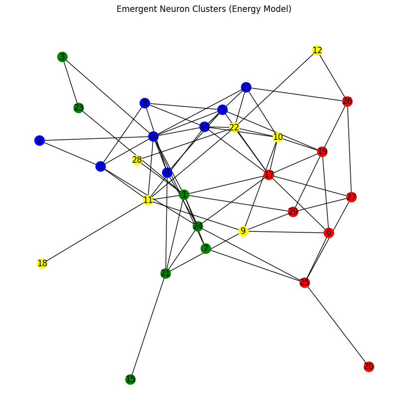
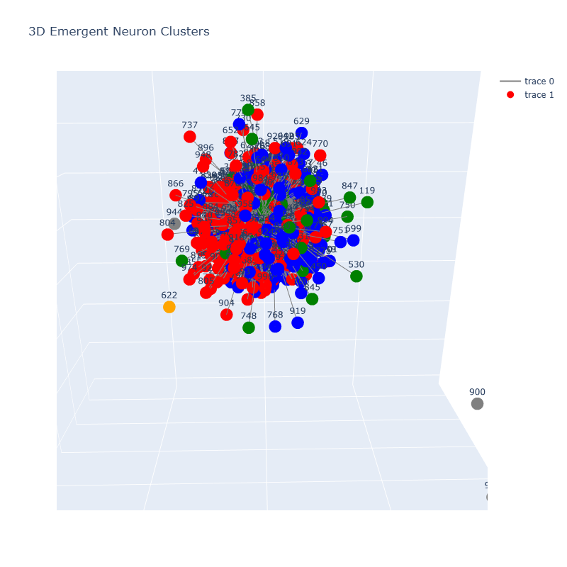
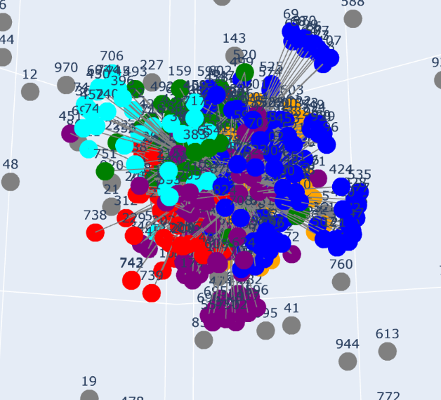

# NeuralCluster

**NeuralCluster** is a research repository investigating **emergent behavior** and **functional clustering** within energy-based neural networks (specifically Hopfield-style networks). 

The project explores how distinct functional regions such as sensory input (Vision) and motor control (RL) can be integrated into a single, unstructured neural fabric, allowing "bridges" and specialized clusters to form naturally through training.

---

## Core Concepts

### 1. Energy-Based Learning
Unlike traditional feed-forward networks, models in this repository (like `HopfieldEnergyNet`) rely on **neuron injection** and **energy minimization**. The network settles into a stable low-energy state that represents the solution or classification.

The neuron injection looks like ```xor_inputs = torch.tensor([[-1.,-1.], [-1.,1.], [1.,-1.], [1.,1.]], dtype=torch.float32)``` with the neuron initialized as ```xor_in_neurons = [0, 1]```. We can also specify what neurons we monitor for outputs: ```xor_out_neurons = [2]```, and focus the training for each task simultaneously, concurrently monitoring several different task losses. From this, I looked towards more complex tasks being contained within the same network, since we can differentiate the output neurons and input neurons, only sharing functional pathways through the network.

### 2. Neuromorphic Architecture
To achieve a more complex architecture, I implemented a biologically inspired design which allowed for more discete information flow. This was not to explicitly form clusters in the network, but instead to prevent the inputs from the RL environment from being crossed with input from the MNIST digits, though this is later joined. The network is conceptually divided into regions to mimic biological structures, though connections can form globally:
- **V1 (Sensory)**: Input handling.
- **V2 (Associative)**: Intermediate processing.
- **Ventral Stream**: The "What" pathway (e.g., MNIST digit recognition).
- **Dorsal Stream**: The "Where/Action" pathway (e.g., RL/Motor control).

The ***Sensory block (V1)*** is where the 28x28 MNIST images were ingested. From there, it is immediately connected to the ***Associative block (V2)*** which handles forming higher order pattern recognition ***without*** Convolutional layers. This is in essence just an MLP, but with directed flow through an energy network. The number patterns are then passed to the ***Ventral Stream*** where they are used for final digit classification. 

On the other side, the ***Dorsal Stream*** handles the entirety of the RL task, where the motor and positional feed are the inputs and the motor control is the output. The important feature is the bridge between the **Dorsal** and **Ventral** which act as a pseudo long-range connection that allows communication between different functional areas. In this case, the MNIST images were incorporated into the RL environment, and whether the digit was **Odd** or **Even** would dictate the reward for moving, motivating to prevent movement during one case. 

### 3. Emergent Clustering
We analyze the network to observe how neurons group together based on connection strength. This is visualized using graph theory techniques to show how the "Vision" part of the brain talks to the "Motor" part. Multiple different clustering algorithms were used, one such being the Greedy Community, to see which neurons shared the strongest weight connections. Hopefully, from the training, the clusters of related neurons (e.g. visual input, ventral stream).

---

## Repository Structure

### `models/`
Contains the core neural network implementations and training notebooks.
- **`integrated_hopfield_rl.py`**: The primary model definition and training script. Integrates MNIST classification with Reinforcement Learning tasks.
- **`transformernet.ipynb`**: Exploration of attention-based architectures.
- **`4taskhopfield.ipynb`**: Earlier experiments with multi-task logic gates (XOR/AND).

### `scripts/`
Analysis and visualization tools to inspect the "brain" of the network.
- **`make_graph.py`**: Generates **3D interactive graphs** of the neural topology, visualizing clusters and connection weights using NetworkX and Plotly.
- **`EI.py`**: Analyzes the **Physics of the Network**. Checks Excitatory/Inhibitory balance (E/I) and calculates the **Spectral Radius** to ensure the network operates at the "Edge of Chaos" (Critical regime).
- **`evaluate_model.py`**: Runs diagnostics to verify if specific functional bridges (e.g., Vision sees a '2' -> Motor plans 'Action A') are active.

---

## Visualizations

### Task-Specific Networks
**4-Task Logic Network**

2D connection visualization



3D connection visualization


**MNIST Classification Network**



**Integrated MNIST + RL Network**



---

## Getting Started

### Packages
- Python 3.8+
- PyTorch
- NetworkX
- Plotly
- Matplotlib
- Kneed (Knee detection for clustering)

### Running the Analysis

**1. Train model & Evaluate Performance**
```bash
python scripts/evaluate_model.py
```
*Output: MNIST accuracy and Bridge Activation heatmaps.*
***Run this to train on both tasks and evaluate***.

**2. Check Network Physics (Stability)**
```bash
python scripts/EI.py
```
*Output: Spectral radius and E/I balance plots.*

**3. Visualizing the Brain Graph**
```bash
python scripts/make_graph.py
```
*Output: Generates a 3D HTML graph of the network.*


---
## Why this doesn't work

Unfortunately, through enough trial and error, I realized that this method would not work. While there are definitely improvements I could have made in the training process and in other aspects, the main issue lies in the fundamental behavior of Hopfield Networks. With the tasks that I gave the model to learn, I explicitly chose them to be significantly different, yet also functions that are necessary for any real, complex living creature to be able to execute, being vision and motor control. In this case, motor control was specifically controlled and purposeful movement, not just random gyration. 

The most critical feature of Hopfield Networks, which explains why they are able to succeed in image recognition (MNIST) yet fail with RL tasks (movement) is that they are **associative memory machines**. When training a Hopfield Network, we learn the weights via the Hebbian Learning Rule:

$`w_{ij} = \frac{1}{N} \sum_{\mu=1}^{M} \xi_i^\mu \xi_j^\mu`$

Where $`\xi_i^\mu`$ is the state of the i-th neuron for the $`\mu`$-th pattern, likewise for the j-th neuron, and $`\frac{1}{N}`$ is a normalization term. With this, patterns are sculpted into the weight matrix, creating attractor basins in the energy landscape. Building off of this, usually it is better suited for learning fewer, more distinct patterns, since more orthogonal patterns are better stored together in the same matrix, otherwise their attractor basins overlap. However, we still observe that the MNIST digits were distinct enough when flattened to be aptly recognized and classified. 

But this only holds up well for pattern recognition. We see a different side when we introduce RL. When constantly trying to reinforce the network towards **patterns of behavior**, the network is constantly being told to rewire for each instance, where the inputs that it is trying to learn are all nearly identical, but one combination may be positive and another negative. When trying to finely teach an associative memory machine such a fine task, it is akin to just constantly carving through energy landscape and making one massive basin. The model will have no signal of when to move or what to do. This exact behavior is observed when we evaluate the model. Even if we separated the two tasks, it still either moves sporadically, or chooses to stay still no matter what, showing that it cannot distinguish any decision boundaries, or between two attractor basins. 


## TO be added:
- RL env explanation (on PC so I can add image)
- Results            (on PC so I can add real results (I think MNIST was around 97%)
